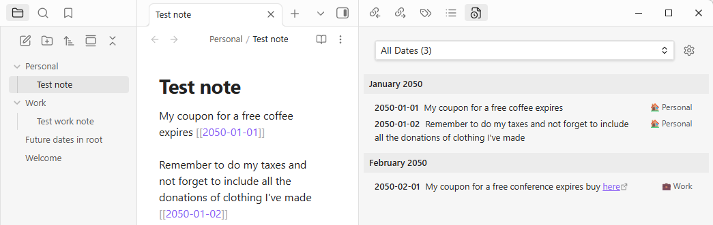

# Future Dates CJW - Obsidian Plugin

> **Note:** This is a fork of the [original Future Dates plugin](https://github.com/slonoed/obsidian-future-dates) by Dmitry Manannikov, with enhancements. See [FORK.md](FORK.md) for details.



## Overview

Future Dates CJW creates a new view in the right panel that automatically collects all links to future dates in your vault. It's helpful to track all upcoming events, deadlines, and tasks in one centralized location.

## Features

✨ **Core Features:**
- Automatically collects all future date references from your vault
- Displays dates in chronological order
- Shows source files and context for each mention
- Real-time updates when you modify notes
- Click to navigate to dates or source files

🎯 **Enhanced in v1.4.0:**
- **Clean date display**: Shows `2025-12-25` instead of `[[2025-12-25]]` for better readability
- **Improved code quality**: Removed debug logging, cleaner codebase
- **Comprehensive documentation**: Full spec-kit documentation in `.specify/` directory

## Installation

### From Obsidian Community Plugins (Coming Soon)
Search for "Future Dates CJW" in Settings → Community Plugins

### Manual Installation

1. Download `main.js`, `manifest.json`, and `styles.css` from the [latest release](https://github.com/chrisweis/obsidian-future-dates-cjw/releases)
2. Create folder: `<vault>/.obsidian/plugins/future-dates-cjw/`
3. Copy the three files into that folder
4. Reload Obsidian
5. Enable the plugin in Settings → Community Plugins

## How It Works

This plugin uses the "Daily Notes" plugin to detect date formats. It scans both resolved and unresolved links in your vault, finding all references to future dates.

### Supported Date Formats
- Default: `[[YYYY-MM-DD]]` (e.g., `[[2025-12-25]]`)
- Custom formats from Daily Notes settings

### Display Structure
```
📅 2025-12-25
  📄 Projects/Work.md
    Meeting with team about 2025-12-25 deadline
  📄 Personal/Todo.md
    Dentist appointment on 2025-12-25 at 2pm
```

## Usage

1. Create links to future dates in your notes: `[[2025-12-25]]`
2. The plugin automatically detects and displays them in the right sidebar
3. Click on dates to open the daily note
4. Click on source files to jump to that note

## Development

### Building from Source

```bash
# Install dependencies
npm install

# Development mode (auto-rebuild on changes)
npm run dev

# Production build
npm run build
```

### Automatic Deployment to Obsidian

For local development, you can automatically deploy to your Obsidian vault:

```bash
# 1. Copy the example config
cp deploy.config.example.json deploy.config.json

# 2. Edit deploy.config.json with your vault path
# Example: "vaultPath": "C:/Users/YourName/Documents/MyVault/.obsidian/plugins/future-dates-cjw"

# 3. Build and deploy in one command
npm run deploy

# Or deploy without rebuilding (if you just changed config)
npm run deploy:only
```

**Benefits:**
- Automatically copies `main.js`, `manifest.json`, and `styles.css` to your vault
- No manual file copying needed
- Faster development iteration
- Works with any vault location

### Project Structure

```
.
├── main.ts              # Plugin entry point
├── model.ts             # Data collection and processing
├── view.ts              # UI rendering
├── .specify/            # Spec-kit documentation
│   ├── memory/
│   │   └── constitution.md
│   ├── specs/
│   ├── tasks/
│   └── plan.md
└── README.md
```

## Roadmap

See `.specify/tasks/current-tasks.md` for detailed task list.

**Upcoming Features:**
- Error handling for file operations (v1.4.x)
- Settings panel for customization (v2.0)
- Filtering and search (v2.0)
- Mobile support (v3.0)

## Credits

**Original Plugin:** [Future Dates](https://github.com/slonoed/obsidian-future-dates) by Dmitry Manannikov

**Fork Maintainer:** Chris Weis

## Contributing

Contributions welcome! Please see [FORK.md](FORK.md) and `.specify/` directory for development guidelines.

## License

The Unlicense (Public Domain) - See [LICENSE](LICENSE)

## Links

- **This Fork**: https://github.com/chrisweis/obsidian-future-dates-cjw
- **Original Plugin**: https://github.com/slonoed/obsidian-future-dates
- **Issues**: https://github.com/chrisweis/obsidian-future-dates-cjw/issues